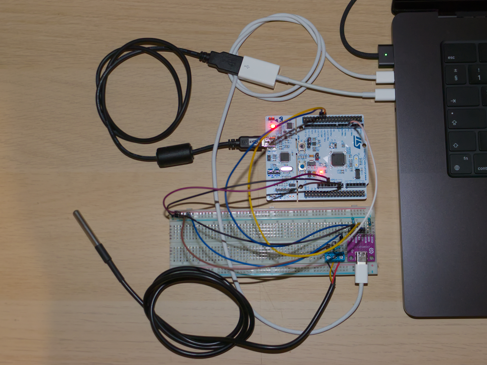

# ODSCI


**An STM32-based USB interface for DS18B20 temperature sensors**



## Getting Started - How to use ODSCI

**If you want to get started using ODSCI quickly, and don't care about the project, this is the only section of the README that matters to you.**

You can grab a pre-built CLI binary from the releases page for your platform/OS, or build from source. The CLI is written in Go and is located in the `/cli` directory.

Connect the ODSCI probe to your computer, and find the serial port that it uses (COM port on Windows, or a /dev/tty device on Linux and MacOS).

Then use the CLI as follows:

```shell
./odsci --port THE_SERIAL_PORT_HERE --samples 100 --interval 10 --output "./output.png"
```

If you would also like a CSV with the values, and not just a graph, you can append `--csv-output "./values.csv"`, where, of course, "values.csv" is the filename.

## Introduction

ODSCI is an STM32-based USB interface for DS18B20 sensors. It stands for **O**neWire **DS**18B20 **C**omputer **I**nterface.

It connects to any computer through a USB-C port and exposes a USB CDC virtual serial port, through which
the MCU can send temperature readings back to the computer.

I am mainly working on this project, in order to teach myself Go (which the CLI uses), while also using it as
an excuse to attempt to write my own OneWire "driver" for the STM32 to communicate with the sensor.

## Project structure

You can find each "part" of ODSCI in its corresponding folder.

1. The firmware that runs on the STM32 is written in C and configured with CubeMX and uses CMake. It is located in the `/firmware` directory.

2. The hardware (PCB) is a KiCad project. It is located under `/hardware`.

3. The enclosure was designed in Fusion360. The project file, as well as any STL exports are located under the `/enclosure`.

4. The CLI is written in Go. You can find its source under `/cli`. I will attempt to cross-compile it for different platforms. Check the repo releases for pre-built binaries.

5. The docs are written with VitePress. You can find them under `/docs`.

## Contributing

You are welcome to report any issues that you find with any part of ODSCI, or open pull requests to fix them.

If you are actually contributing code to the project, make sure that you understand the license terms.

## Licensing

Different parts of the project are licensed under different licenses.

Under each directory, you will find a separate LICENSE file for that part of the project.

While that may seem a little confusing at first, please understand that some parts like the PCB simply
aren't very compatible with the usual licenses like MIT, GPL, etc.

See [LICENSE](LICENSE) for more info.
